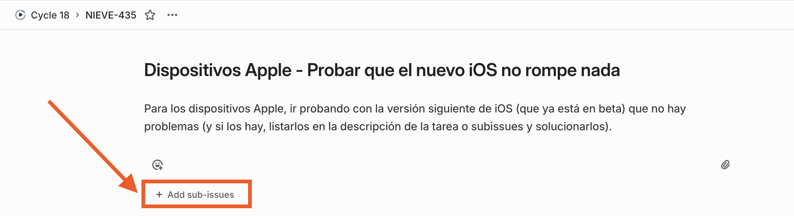
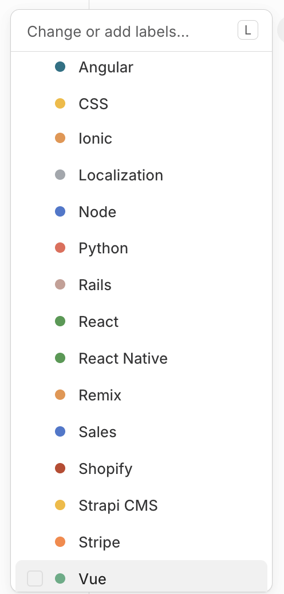
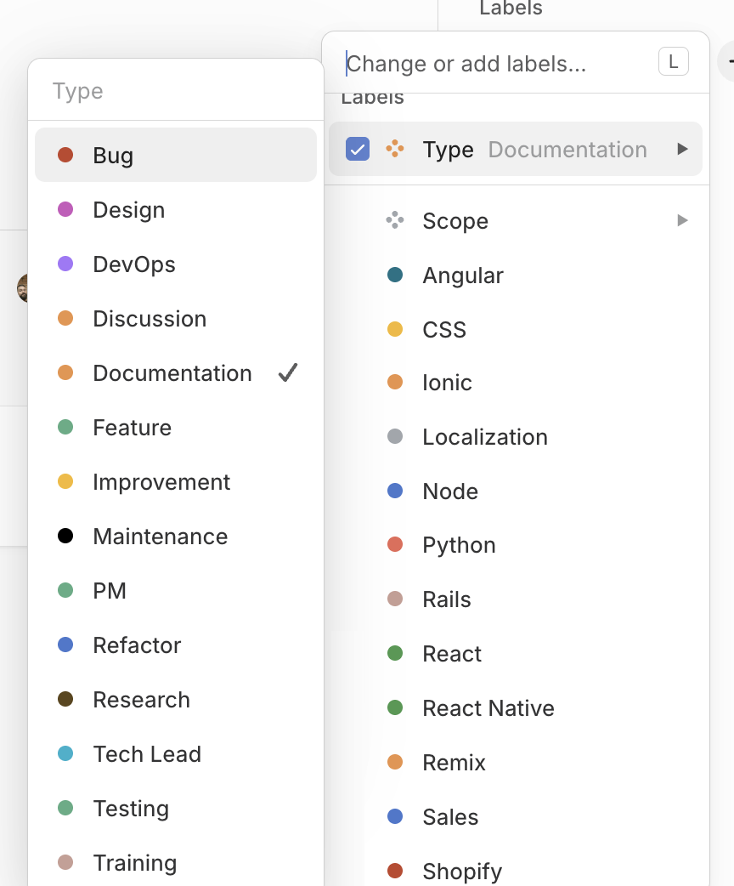
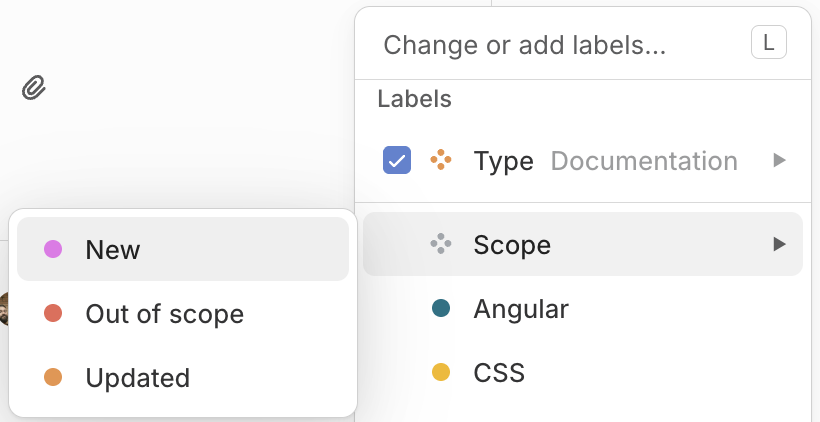
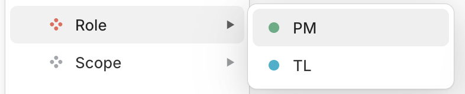

# Linear guidelines

This document contains information and templates about how to use Linear for organizing projects and defining issues. 

## Table of Contents

  - [Milestones](#milestones)
    - [Use Milestones to Track the Progress of a Project](#use-milestones-to-track-the-progress-of-a-project)
    - [Assign Tasks to Milestones](#assign-tasks-to-milestones)
  - [Epics](#epics)
    - [When to use Epics](#when-to-use-epics)
    - [How to Use the Epic Tag](#how-to-use-the-epic-tag)
  - [Issue Title](#issue-title)
    - [Be Descriptive and Concise](#be-descriptive-and-concise)
    - [Include Page/Module Name in the Title](#include-pagemodule-name-in-the-title)
  - [Labels for Issues](#labels-for-issues)
    - [Purpose of Labels](#purpose-of-labels)
    - [Recommended Labels](#recommended-labels)
  - [Project & Issues Linear Templates](#project--issues-linear-templates)
    - [Project Template](#project-template)
    - [Bug](#bug)
    - [Independent Frontend Task](#independent-frontend-task)
    - [Independent Backend Task](#independent-backend-task)
    - [Independent Task with Frontend and Backend Work](#independent-task-with-frontend-and-backend-work)
    - [Epic](#epic)

## Milestones

### Use Milestones to Track the Progress of a Project 

Break down projects into key milestones. Each milestone should represent a significant achievement or phase in the project. The definition of these milestones will depend on the specifics of the project, and it is essential to analyze and determine, at the beginning, how the project should be distributed across its phases. Each milestone should correlate with a tangible deliverable of the project. They can represent various elements such as:

- **Modules of the Application.** Key components or features that define the project scope.  
- **Important Dates.** Significant deadlines throughout the project lifecycle, such as design phase completion, when the project will be ready for Quality Assurance (QA), or the date scheduled for the production release.

### Assign Tasks to Milestones

Link Linear issues to the relevant milestone. This helps in tracking progress and ensures that all tasks contribute to the project’s objectives.

## Epics

### When to use Epics

The project manager should use the Epic tag in the following scenarios:

- **Defining Major Features.** When a client request or project requirement involves a substantial feature that requires multiple tasks or components to be developed.  
- **Decomposing Complex Tasks.** When identifying complex tasks that exceed a single sprint or iteration timeline, and thus it needs further breakdown into smaller, actionable items.  
- **Cross-Functional Initiatives.** When a project spans multiple teams or disciplines (e.g., frontend, backend, QA), and it requires coordination among various contributors.

### How to Use the Epic Tag

1. **Create an Epic Issue.** In Linear, create a new issue representing the Epic and apply the "Epic" tag. Provide a clear and concise title followed by a detailed description of the feature's scope, objectives, and any relevant criteria for completion.  
2. **Assign the Epic to the PM.** Assign this Epic issue to the Project Manager who will oversee its development.  
3. **Decompose into Subissues.** Break the Epic down into smaller subissues that specify individual tasks or components necessary to achieve the Epic's objectives. Each subissue should include:  
   - A clear title and description.  
   - Assignment to the appropriate developer or team member responsible for executing that task.  
4. **Link Subissues to the Epic.** Ensure that all relevant subissues are linked back to the Epic issue. This is only necessary if the subissues are NOT created using the **+ Add sub-issues** action of the Epic task.  

    

5. **Close the Epic Upon Completion.** Once all subissues are completed and the feature is fully developed and tested, the PM should mark the Epic as complete.

## Issue Title

### Be Descriptive and Concise

Use clear and descriptive titles that accurately convey the essence of the task or issue. Aim to keep the title concise, yet informative enough to understand the context without additional detail.

### Include Page/Module Name in the Title

When needed, clearly specify the page or module where the issue or feature will be applied. This helps to contextualize the task and allows for easy identification of where changes or developments will take place. Always use the following format for including the page or module name in the issue title:

* `[<Module/Page>] <Brief Description>`
* *Example:* [Login Page] Fix UI Overlap Issue

## Labels for Issues

### Purpose of Labels

Labels in Linear serve to categorize and provide context for issues, making it easier for team members to filter and prioritize tasks.

### Recommended Labels

- ***Technology*** **Labels.** Especially useful in projects that have a backend and a frontend, or that mix several technologies. MarsBased already has a set of labels that are specific to technologies in the first label. If you think you might need a different one, ask another PM to help you on this.

    

- ***Type*** **Labels.** This label is essential for categorizing issues based on their nature or activity within the project. As for technologies, MarsBased already has a set of labels that are specific to types.  

    

- ***Scope*** **Labels.** This label serves to classify issues based on their relationship to the project's established scope. It helps teams track changes in features and functionalities, ensuring everyone understands whether an issue pertains to new developments, adjustments, or exclusions from the original project scope. Possible values:
  - **New.** This label indicates that the issue pertains to a new feature or requirement that was not included in the original project scope or initial estimates.  
  - **Out of Scope.** This label is used for features or tasks that are deemed outside the project's defined boundaries and will not be included in the current development cycle, but we still want to keep them in the project for traceability purposes.  
  - **Updated.** This label signifies that there have been changes to previously defined features or requirements during the project lifecycle that affect the original scope of the task and its estimates.  

    

- ***Role*** **Labels.** This label serves to classify issues based on the role that should develop it.

    

> **NOTE:** If at some point you think you might need a different label for any category, ask another PM to help you with this.  

## Project & Issues Linear Templates

All these templates are available in Linear too.

### Project Template

Corresponds to the template of the Overview page of the projects in Linear.

- **Description.** Short description of the project.  
- **Architecture.** Overview of the architecture of the project.  
- **Who is who.** This section provides a brief introduction to the key team members involved in the project, outlining their roles and responsibilities.  
- **Deployments.** Explanation of how deployments are done in the project. Differentiate between Staging and Production deployments if needed.  
    - **Who can deploy.** List of people authorized to perform deploys of the project. Differentiate between Staging and Production deployments if needed.  

### Bug

- **Label.** Use always *Bug*.  
- **Environment.** Specific environment details (e.g., browser, OS).
- **Steps to Reproduce.** Instructions to replicate the issue.  
- **Actual Outcome.** What actually happened. 
- **Attachments.** Videos or images supporting the actual outcome.
- **Expected Outcome.** What the expected behavior should be.  

### Independent Frontend Task

- **Description.** Detailed explanation of the task requirements.  
- **Error Control.** Errors that need to be handled.  
- **Acceptance Criteria.** Conditions that must be met for the task to be considered complete.  
- **Design Specifications.** Relevant design files or mockups for the task.  
- **Modifications Over Design.** Changes over the previous files that need to be implemented.  
- **Adherence to Design.** Is pixel-perfect needed?  
- **Performance Considerations.** Notes on performance or optimization requirements.  
- **Component Name.** Name of the component or element being created.  
- **Other Considerations.** Cross-browser compatibility, accessibility, etc.  

### Independent Backend Task

- **Description.** Detailed explanation of the task requirements  
- **Error Control.** Errors that need to be handled  
- **Acceptance Criteria.** Conditions that must be met for the task to be considered complete  
- **Technical Definition.** This may include:  
  - **Source Code Details.** Guides on how the feature should be implemented and/or parts of the source code that need to be modified or taken into account.  
  - **Database Changes.** Specific changes needed in the database (e.g., schema modifications)  
  - **API Endpoints.** New or updated API endpoints to be implemented  
  - **Security Considerations.** Notes on required security measures or compliance  
  - **Testing Requirements.** Details on testing that needs to be performed (e.g., unit tests, integration tests)  

### Independent Task with Frontend and Backend Work 

- **Description.** Detailed explanation of the feature requirements.  
- **Error Control.** Errors that need to be handled.  
- **Acceptance Criteria.** Conditions that must be met for the feature to be considered complete.  
- **Attachments.** Relevant files, mockups, design specifications.  
- **Frontend Tasks.** Specific tasks or implications to be developed in the frontend.  
  - **Design Specifications.** Relevant design files or mockups for the task.  
  - **Modifications Over Design.** Changes over the previous files that need to be implemented.  
  - **Adherence to Design.** Is pixel-perfect needed?  
  - **Performance Considerations.** Notes on performance or optimization requirements.  
  - **Component Name.** Name of the component or element being created.  
  - **Other Considerations.** Cross-browser compatibility, accessibility, etc.  
- **Backend Tasks.** Specific tasks or APIs to be developed on the backend.  
  - **Technical Definition.** This may include:  
    - **Source Code Details.** Guides on how the feature should be implemented and/or parts of the source code that need to be modified or taken into account.  
    - **Database Changes.** Specific changes needed in the database (e.g., schema modifications).  
    - **API Endpoints.** New or updated API endpoints to be implemented.  
    - **Security Considerations.** Notes on required security measures or compliance.  
    - **Testing Requirements.** Details on testing that needs to be performed (e.g., unit tests, integration tests).  

### Epic

- **Label.** Use always *Epic*.  
- **Assignee.** Use always *<project_manager>*.  
- **Description.** Detailed explanation of the feature requirements.  
- **Attachments.** Relevant files, mockups, design specifications.  
- **Frontend Tasks (as subissues).** Specific subtasks to be developed in the frontend (created as actual subissues in Linear).  
- **Backend Tasks (as subissues).** Specific tasks or APIs to be developed on the backend (created as actual subissues in Linear).  
