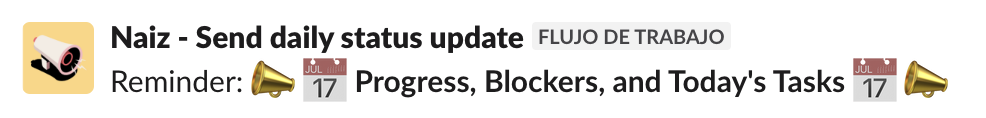
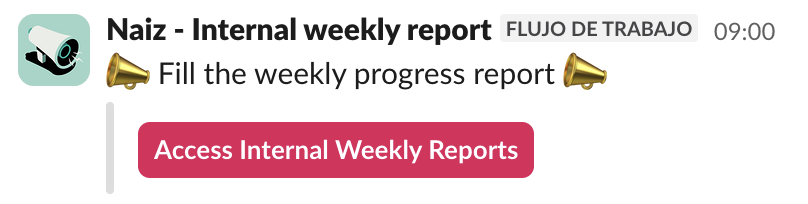
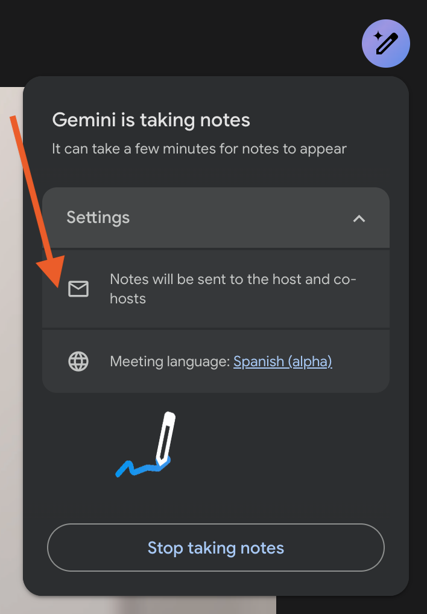

# Project Management Guidelines

This document contains information on actions related to managing projects that should be shared across all projects.

That way, developers and tech leads will work the same way regarding management, no matter which project they are working on. It will also help project managers when we need to transfer a project or check the status of another project for whatever reason. 

## Daily updates

Set a workflow on the internal Slack channel of the project at 12 pm each weekday, so developers can share the progress they have made since the last update they did. This helps developers to share their progress, comment on blockers, doubts, etc. Take into account that sharing this information does not excuse them from maintaining Linear up-to-date.  

    

> **NOTE:** To create a workflow on the channel, you can just copy a similar existing one and make the needed adjustments to fine-tune it to the project. 

## Internal weekly reports

Internal weekly reports have the goal to help project managers fill the progress reports that are sent to the client.  They are supposed to be filled by everyone working on the project on Friday, before they close their week. Filling it on Friday helps developers to have all the issues more recent in their heads. That way, project managers have all the information ready on Monday to fill the progress report for the clients. 

> **NOTE:** Although team members fill these reports, it is still good to check the Linear status of the project to make sure nothing is left out of the report. 

The template for the  Internal Weekly Report can be found here: [Internal Weekly Report](https://docs.google.com/document/d/1BRmL2qPBwbF6WfapEaoOjqvPqsfS0Y9ijem9OS6GT4A/edit?usp=drive_link). It is already available as a Google Doc template in the MarsBased workspace, so when creating the first internal weekly report for your project you can do it with the option “From a template” when creating a new Google Document. Please, create the report on Monday so team members can fill it up during the week if they consider it appropriate, or just in case someone closes earlier than Friday. 

To make sure everyone remembers to fill the report, we have 2 reminders:
- On Friday, we tag each person in a comment on the document.
- On Slack, we have a weekly reminder using also a workflow (on Friday, at 9 am). 

    

> **NOTE:** To create a workflow on the channel, you can just copy a similar existing one and make the needed adjustments to fine-tune it to the project. 

## Budget control

On projects that are closed-scope and we need to keep on a budget, it is good to do budget control on a weekly basis. Preferably, this should be done at the beginning of the week, to make sure Harvest is up to date.

To standardise this, we can use the same organization on a spreadsheet and keep improving it as we see the need.

An example of this document can be found in the  Project Management Templates Drive folder, in the file [Hours control example](https://docs.google.com/spreadsheets/d/118kwlli8-m5qEXpIBtwdkWlEV9q54Thu431lUPG-0QU/edit?usp=drive_link). If you have any doubts regarding the content of this file or how to use it, contact another project manager.

## Drive folder organization

1. **File naming.** Include in the name of the files the date using the following format: `<YYYY-MM-DD> <Name of the file>`, especially those of meetings and reports. That way, documents can be easily sorted, and the last ones can be accessed.

2. **Folder structure.** Try to adhere as much as possible to the following structure:
   - **Reports.**
     - Folder that contains all reports sent to the client.
   - **Internal weekly reports.**
     - Folder that contains all the internal weekly reports of the team.
   - **Meeting notes.**
     - Folder that contains all the notes of the meetings of the project.
     - Ideally, there should exist notes for all the weekly internal project review meetings and all meetings with the clients that have some entity (progress meetings, change of scope meetings, etc.).
   - **Functional documentation.**
     - Folder that contains all the functional documentation of the project.
   - **Technical documentation.**
     - Folder that contains all the technical documentation of the project.
   - **Contracts.**
     - Folder that contains all the contracts signed with the client.
   - **Archive.**
     - Folder that contains old documents of the project, which are outdated or not relevant anymore, but are maintained there for traceability purposes. E.g., functional definitions or DB schemas that are outdated.
   - **Shared.**
     - Folder that contains documents shared with the client.

> **NOTE:** All folders can be organized internally by years if necessary.

## Use of Google Gemini

To ensure effective communication and proper documentation of meetings and updates, the following steps should be followed:

1. **Record weekly internal meetings**  
   It is important to record internal weekly meetings to maintain a record of discussions and decisions made.

2. **Record weekly meetings with the client / relevant meetings**  
   All weekly meetings with the client, as well as other relevant meetings, should be recorded for future reference and to ensure that all points of discussion are documented.

3. **Move to the project’s meeting notes folder**  
   After recording the sessions, the recordings should be organized and transferred to the “meeting notes” folder of the respective project in Google Drive. This will facilitate access and future consultation.

    

        
    

4. **Set up to ensure everyone receives the notes**  
   Make sure that all team members have access to the meeting notes (and recordings when necessary) and receive appropriate notifications to avoid missing any relevant information.
