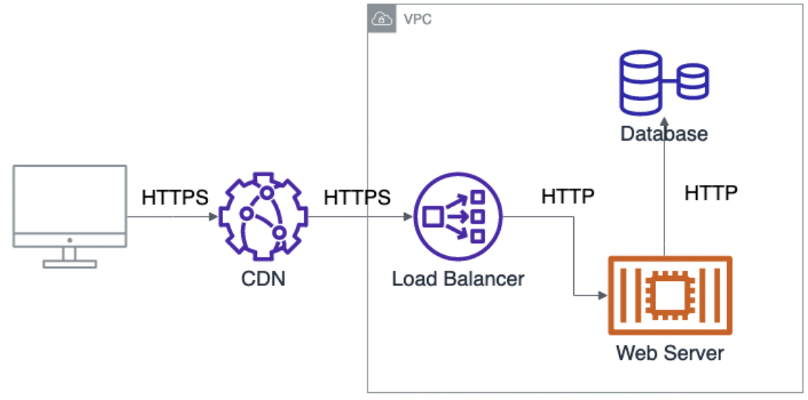

# Web Application Security Features

Any web application we build at MarsBased should implement the following security features.

The Tech Lead or Project Manager of each project should talk to the client to encourage their implementation, citing the importance of minimizing the risk of the application getting exploited.

Of course, there are cases where having a secure application is less or more important. Sometimes a compromise will need to be reached, and implement only the most critical features. For example, an internal application that is not exposed to the public and which does not store sensitive data is not the same as a public-facing application storing medical records.

## No credentials in code. No credentials in generated artifacts

**Make sure there are no hardcoded credentials in the code. These include passwords, API keys, certificates, etc.**

Use environment variables or other means to store credentials and retrieve them during application runtime. In Rails, you may also use [encrypted credentials](https://edgeguides.rubyonrails.org/security.html#environmental-security).

**Make sure there are no credentials in artifacts generated by the application. The most common scenario is inadvertently including credentials in Docker images. But it can also happen in mobile or desktop application builds.**

ℹ️ You can use [trufflehog](https://github.com/trufflesecurity/trufflehog) to automatically detect some common credentials in a repository. You may use it with a Github Action to run automatically on all Pull Requests. You may also add a git commit hook to run it before or after every commit.

## Credentials in Docker images

Even if there are no hardcoded credentials in the code, you will most probably have local gitignored files with real credentials. For example, you might have a _.env_ file with credentials or a _secrets.yml_ file used by Kubernetes.

When generating Docker images for deployment, it is common to have a _COPY . ._ statement in the Dockerfile. This copies everything in the application directory, including any gitignored file we might have with production credentials.

To prevent these sensitive files from being included, create a _.dockerignore_ file listing all of them.
This might not be relevant when doing a deployment from a CI system but it is when doing a deployment or generating an image from a local environment.

## Force encrypted traffic (HTTPS)

⚠️ Any unencrypted traffic request (HTTP) arriving at the application is vulnerable to being read by an attacker. For example, a login request sent through HTTP includes the password in plain text. Anyone listening to the network can see the request and steal the password.

It's crucial to make sure all traffic arrives at the application via HTTPS.

Use the following rules:

- Redirect all HTTP requests to HTTPS.
- Send an [HSTS header](https://en.wikipedia.org/wiki/HTTP_Strict_Transport_Security). This tells the browser to only interact with the application using HTTPS even when the user attempts to send a request with HTTP. By sending this header we make sure that even the first connection to the application is secured.

### Implementation

#### Rails

Add _config.force_ssl = true_ to _config/environments/production.rb_ and any other non-development environment.

#### Next.js

Configure HSTS and HTTP→HTTPS redirects at the edge using `next.config.js` headers and your reverse proxy/load balancer:

```js
// next.config.js
module.exports = {
  async headers() {
    return [
      {
        source: "/(.*)",
        headers: [
          {
            key: "Strict-Transport-Security",
            value: "max-age=63072000; includeSubDomains; preload",
          },
        ],
      },
    ];
  },
};
```

Also enforce HTTPS at the platform level (e.g., Vercel/CloudFront/Nginx) by redirecting HTTP to HTTPS with a 301.

References:

- Next.js headers config: `https://nextjs.org/docs/app/api-reference/next-config-js/headers`

#### Custom

- Redirect all non-HTTPS requests to the equivalent HTTPS URL, using a 301 Permanent redirect.
- Manually add the HSTS header to all server responses: _Strict-Transport-Security: max-age=31536000; includeSubDomains; preload_

### SSL Certificates

In order to serve HTTPS traffic, the server needs to have an SSL certificate. SSL certificates can be obtained from a Certificate Authority (CA). Some of them offer free certificates while others require purchasing them.

One of CAs most commonly used is [LetsEncrypt](https://letsencrypt.org/). LetsEncrypt offers free SSL certificates suitable for common use cases and also offers a set of tools to manage these certificates automatically on the servers.

Additionally, most common cloud providers have a service to generate managed SSL certificates. For example, AWS has the [AWS Certificate Manager](https://aws.amazon.com/certificate-manager/) and Google Cloud has a [Certificate Manager](https://cloud.google.com/certificate-manager/docs/overview) too. These are very useful when used in conjunction with other managed services from the cloud providers and remove the need to manually have to install and renew the certificates.

### Real-world setup

In a real-world setup, we have a number of internet-facing services that together form an application. Because it is expensive to manage SSL certificates it's not necessary to have absolutely all communication between those services be done using HTTPS.

In particular, once traffic enters a virtual network (all cloud providers have this concept) the traffic is already isolated from the rest of the world and it can switch to HTTP.



## Use secure and encrypted

User sessions are an important part of most web applications. They allow the app to store state in the browser and pass it to the web application on each request. It is important to protect it because, in the wrong hands, it would allow someone to use the application on the user's behalf.

It is common to store the user sessions in Cookies. Make sure that:

- **The session cookie is marked as secure**: Secure cookies are only sent with HTTPS requests.
- **The session cookie is encrypted**: Even if the cookie was read, it would be useless.

### Implementation

#### Rails

Add _config.force_ssl = true_ to _config/environments/production.yml_ and any other non-development environment. Rails encrypts session cookies by default.

#### Next.js

Use the server-side cookies API and set secure attributes:

```ts
// app/lib/session.ts
import { cookies } from "next/headers";

export async function setSessionCookie(value: string, expiresAt: Date) {
  const store = await cookies();
  store.set("session", value, {
    httpOnly: true,
    secure: true,
    sameSite: "lax",
    path: "/",
    expires: expiresAt,
  });
}
```

Encrypt the cookie value server-side and avoid exposing it to client code.

References:

- Cookies API: `https://nextjs.org/docs/app/api-reference/functions/cookies`
- Authentication (sessions): `https://nextjs.org/docs/app/building-your-application/authentication`

#### Custom

Add the _Secure_ attributes to the session cookie. Encrypt/Decrypt the session cookie in the server using a generated secret key.

## Protect against Cross-Site Request Forgery (CSRF)

CSRF consists of making a user inadvertently execute an authenticated request to an application where she is logged in.

Let's imagine a user is an administrator at https://yourapp.com. And he has an active session on the site. The user browses a message board where an attacker has crafted a message that contains a fake img HTML element:

```html

```

If the _/admin/admin_users/create_ endpoint does not have CSRF protection, when the user loads this message the request will be executed. Since the user is authenticated, it will create a new admin user. The attacker can now use this admin user to access the administration panel of https://yourapp.com.

In most cases, such an endpoint will not accept a GET request. An attacker can still send a POST request using for example the _mouseover_ attribute of the img element with something like this:

```html

```

If the message board does not have proper XSS protection, the request will be executed.

### Mitigation

CSRF attacks are commonly mitigated by requiring all non-GET requests to include a CSRF token. This token is randomly generated by the server, so it's impossible for an attacker to guess it.

Usually, it is accomplished by including a hidden input in all forms rendered by the application. For example:

```html
<input
  type="hidden"
  name="authenticity_token"
  value="Z-L3yUHAosQMW0OXMdMveWCIeODeCcXo419zpuUhBBUge9y5-aWZ4GUGFnZmoKNQa3shS8VlSTZuRG8q_ALpvA"
/>
```

The value is randomly generated by the server.

Then, server side, we check the token against the same token saved elsewhere (usually in the user session).

For AJAX requests, if we can't include the token as a parameter, a common approach is to take it from a meta tag in the page and send it with a header with every request. This is a simple example with jQuery to include the header in every AJAX request:

```javascript
$(document).ready(function () {
  var csrfToken = $('meta[name="csrf-token"]').attr("content");
  if (csrfToken) {
    $.ajaxSetup({
      headers: { "X-CSRF-Token": csrfToken },
    });
  }
});
```

### Implementation

#### Rails

Rails includes CSRF protection by default. Everything is taken care of by the framework automatically.

#### Remix

Remix includes CSRF protection with the npm package [remix-utils](https://github.com/sergiodxa/remix-utils). Check the package documentation for further details.

## Implement a strict Content Security Policy (CSP)

CSP is the best protection you can implement against XSS attacks (and many other attack methods). It consists of telling the browser the trusted sources from which to allow external resources (scripts, stylesheets, audio, video, etc.).

It is implemented by sending a _Content-Security-Policy_ header in server responses with a policy definition. The policy specifies in as much detail as wanted the allowed sources for each type of resource. The full reference can be found on the MDN page.

Ideally, you should write a different CSP policy per page, because not all pages need to load the same resources. At least, you should do it for each application scope. For example, the admin panel probably does not need to allow the same sources as the landing page.

### Policy definition

A policy consists of a set of directives separated by a semicolon (;). Each directive defines the trusted sources for a particular resource type.

This is what a policy may look like:

```text
Content-Security-Policy:
default-src self https://cdn.app.mars; <-- this is the fallback if a particular resource type is undefined
script-src self cdn.jquery.com;
style-src self jquery-styles.com;
img-src *;
child-src none;
```

The first word on each directive is the resource type and the rest of the values indicate the trusted sources.

### Directives

- _script-src_: Javascript _&lt;script&gt;_ nodes.
- _style-src_: CSS _&lt;style&gt;_ nodes.
- _child-src_: web workers and iframes. Set to _'none'_ if you don’t need iframes.
- _img-src_: _&lt;img&gt;_ elements.
- _media-src_: _&lt;audio&gt;_ and _&lt;video&gt;_ nodes.
- _object-src_: _&lt;object&gt;_, _&lt;embed&gt;_ and _&lt;applet&gt;_. Just set to _'none'_ and forget.

### Values

- _none_: Disallow loading from anywhere, even from the page.
- _self_: Allow only from the current origin (does not allow subdomains).
- _unsafe-inline_ and _unsafe-eval_: Allow to execute inline scripts. Never use these values.
- Remote resource: Allows to specify a set of remote resources with more or less granularity. It accepts any of the following forms:
  - _\*.app.mars_: Allows any resources from any subdomain of _app.mars_.
  - _cdn.app.mars_: Allows any resource from the exact _cdn.app.mars_ domain.
  - _https://cdn.app.mars_: Allows any resource from the exact _cdn.app.mars_ domain but only when loaded with HTTPS.
  - _https://cdn.app.mars/assets_: Allows any resource from the exact _cdn.app.mars_ domain, only when loaded with HTTPS and only if it starts with the /assets path.
  - _https://cdn.app.mars/assets/app.js_: Allows only the exact resource.
- _https:_, _http:_ or _data:_: Allow from any domain as long as it uses the specified protocol.
- _nonce-\*_: Safe inline scripts and styles. More on this later in the guide.

## Loading scripts and other resources from external origins

Most probably you will need to load scripts from Google, Facebook, and other analytics services, or images from a CDN.

In that case, list the origins one by one. For example:

```text
Content-Security-Policy: script-src 'self' *.facebook.net www.google-analytics.com; img-src 'self' mycdn.myapp.com;
```

⚠️ IMPORTANT: If you are using Google Tag Manager, some script might be dynamically included in the page. It is important to figure out the scripts added this way to allow the appropriate origins. You can use [Violation reporting](#violation-reporting) to discover some unknown scripts being added.

## Loading inline scripts

Often, you will need to allow inline \_&lt;script&gt; elements because you are using them yourself to build some functionality on a page or to pass some data from the server to a Javascript process.

In this case, make use of nonces. Instead of using _unsafe-inline_ to allow inline script, use _nonce-\*_. This value allows inline script but only if they include the same nonce value you have specified in the policy. For example, the following policy:

```text
Content-Security-Policy: script-src 'self' 'nonce-1234567890abcde';
```

Will only allow scripts to be executed on the page if they include the nonce:

```html
<script nonce="1234567890abcde">
  console.log("hello");
</script>
```

This makes it possible to make use of our own inline scripts on the page while making it impossible to execute malicious _&lt;script&gt;_ forged by attackers.

### Violation reporting

CSP includes a feature to get alerted of all violations. A violation happens when a resource can't be loaded due to a CSP policy. This is a great tool, not only to be aware of errors users might be facing but also to initially discover all external resources being loaded when initially building a set of policies for an application. This is especially relevant when there might be scripts included dynamically as a result of using Google Tag Manager.

A common approach when adding CSP to an existing application is to enable it only in reporting mode at first, then gather all the resources for some time and finally enforce the policies.

Adding a reporting URL only requires adding _report-uri https://myapp.com/csp_violation_ to the header. You can find more details in the [MDN site](https://developer.mozilla.org/en-US/docs/Web/HTTP/Headers/Content-Security-Policy#reporting_directives).

### Best practices

- Completely disallow any resource types not used on the page. Use the value 'none' for those. Most common:
  - _object-src_: _&lt;object&gt;_, _&lt;embed&gt;_, and _&lt;applet&gt;_.
  - _child-src_: web workers and _&lt;iframe&gt;_.
  - _media-src_: _&lt;audio&gt;_, _&lt;video&gt;_.
- Write a policy as strict as possible. Start by allowing only the same origin (_'self'_ value) and add more trusted hosts if necessary.
- Avoid adding the _https:_ value. This would allow resources to be loaded from any origin. When you need to load from external sources, list them individually. Read below for a more detailed explanation.
- Never use the _'unsafe-inline'_ value.

### Implementation

#### Rails

Starting from version 6, Rails includes CSP protection by default. It has a default policy that allows you to tune it according to the needs of each application.

#### Next.js

Set a strict CSP with nonces via middleware and propagate the nonce to scripts:

```ts
// middleware.ts
import { NextResponse } from "next/server";

export function middleware(request: Request) {
  const nonce = Buffer.from(crypto.randomUUID()).toString("base64");
  const csp = `default-src 'self'; script-src 'self' 'nonce-${nonce}' 'strict-dynamic'; style-src 'self' 'nonce-${nonce}'; img-src 'self' data: blob:; object-src 'none'; base-uri 'self'; form-action 'self'; frame-ancestors 'none'; upgrade-insecure-requests;`;

  const response = NextResponse.next();
  response.headers.set("Content-Security-Policy", csp);
  response.headers.set("x-nonce", nonce);
  return response;
}
```

Then read and apply the nonce where needed (e.g., `<Script nonce={nonce} />`). In development, you may relax `'unsafe-inline'`/`'unsafe-eval'` conditionally but keep production strict.

References:

- Content Security Policy: `https://nextjs.org/docs/app/guides/content-security-policy`
- Subresource Integrity (experimental): `https://nextjs.org/docs/app/guides/content-security-policy#subresource-integrity-experimental`

### Check external resource integrity

ℹ️ Subresource integrity is a standard that protects against attackers modifying the contents of JavaScript libraries hosted on content delivery networks (CDNs) in order to create vulnerabilities in all websites that make use of that hosted library.

When including a _&lt;script&gt;_ or _&lt;link&gt;_ tag (to include a JS, CSS, or other files) on a page pointing directly to an external resource, always add the _integrity_ attribute. When the attribute is present the browser will make sure the contents of the download resource file match the integrity hash before executing it.

Always add _crossorigin="anonymous"_ when adding the integrity attribute to prevent cookies from being sent when loading the resource.

Example:

```html
<!-- Load jQuery 3.7.1 from their CDN -->
<script
  src="https://code.jquery.com/jquery-3.7.1.min.js"
  integrity="1H217gwSVyLSIfaLxHbE7dRb3v4mYCKbpQvzx0cegeju1MVsGrX5xXxAvs/HgeFs"
  crossorigin="anonymous"
></script>
```

### How to generate the integrity hash

The integrity hash can be generated manually from any unix terminal with:

```bash
curl -s https://code.jquery.com/jquery-3.7.1.min.js | \
    openssl dgst -sha384 -binary | \
    openssl base64 -A
```

Alternatively, it can also be generated with the [SRI Hash generator](https://www.srihash.org/) online tool.

## Disallow redirecting the user to arbitrary domains

Be careful when using user-supplied parameters or other user-inputted data to redirect the user. A common vulnerability is to use a _redirect_to_ query parameter in a login request to redirect the user to a specific URL after login.

Without validation of the value received in the parameter, we are giving the ability for anyone to craft a login link that will redirect to another site. **Always validate the parameter to make sure it's just a URL path without the host.**

## Avoid mass-assignment

When creating and modifying records from the database, avoid mass-assigning parameters received in the request. Instead, whitelist or hand-pick the parameters to use for the assignment.

❌ Bad: _update(user, params)_
✅ Good: _update(user, slice(params, ['name', 'city', …])_

When mass assigning all the params without filter we are giving users the ability to modify protected attributes like the role, pricing plan, etc.

### Implementation

#### Rails

Rails has mass-assignment protection by default by using protected attributes. Before using parameters to make a creation or update Rails forces a call _permit_ on the params object with the list of allowed parameters.

#### Next.js

Never spread unvalidated request bodies into ORM calls. Validate and whitelist fields before persisting:

```ts
// app/api/users/route.ts
import { NextRequest, NextResponse } from "next/server";
import { z } from "zod";

const UserUpdate = z.object({
  name: z.string().min(1),
  city: z.string().optional(),
});

export async function PATCH(req: NextRequest) {
  const json = await req.json();
  const data = UserUpdate.parse(json);
  // use `data` only; never pass `json` directly to the DB
  // await db.user.update({ where: { id }, data })
  return NextResponse.json({ ok: true });
}
```

References:

- Data Security: sanitizing and server-only data flow: `https://nextjs.org/docs/app/guides/data-security`

## Avoid logging sensitive data

Make sure you are not writing any sensitive data to logs. These include user passwords, API tokens, nonces, etc.

For example: a login request will probably log the e-mail and password parameters. The password parameter should be filtered or removed to avoid it being written to the logs.

### Implementation

#### Rails

Rails already filters the most common parameters by default. You can instruct Rails to filter other parameters with the config.filter_parameter_logging configuration option

#### Next.js

Audit logs and redact sensitive parameters before writing. Avoid logging raw request bodies, cookies, tokens, and secrets. Use structured logging and explicit allow-lists for fields.

References:

- Authentication (sessions): `https://nextjs.org/docs/app/building-your-application/authentication`

## Keep dependencies up to date

Taking care of an application's dependencies is as important as taking care of the application itself. Even if you make sure an application is secure, some of its dependencies may still have vulnerabilities or security holes.

It is very important to keep all application dependencies up to date with the latest security patches. This does not mean having all dependencies updated to their last major version. It just means having the latest security patch version within the major version used by the application.

Dependencies that should be up to date include:

- **Language runtime**: Ruby, NodeJS, etc.
- **Libraries used in the application**: Ruby gems, NodeJS packages, etc. Both in the back-end and front-end.

You should regularly check for new security patches and apply them as soon as possible.

An easy way to keep libraries up to date is to use [Depfu](https://depfu.com/) or [Dependabot](https://docs.github.com/en/code-security/dependabot). Both of these tools integrate with GitHub and other repository services to automatically open pull requests when an update is required. It can be configured to take care only of security updates or to open pull requests for any version update. Check the corresponding documentation to learn more about how they work.

Ideally, you should also take care of having all the infrastructure components surrounding the application up to date:

- **Operating System**: usually it's part of the base Docker image used for deployment.
- **System packages**: Imagemagick, database clients, etc.
- **Database**.
- **Other services**: Redis, ElasticSearch, etc.
- **Deployment system**: Kubernetes for example.

⚠️ IMPORTANT: At some point, major versions of any piece of software stop receiving security updates. When this happens to a major version of a library or other software component, then it's required to update it to a major version to one that still has Long-Term Support (LTS).
